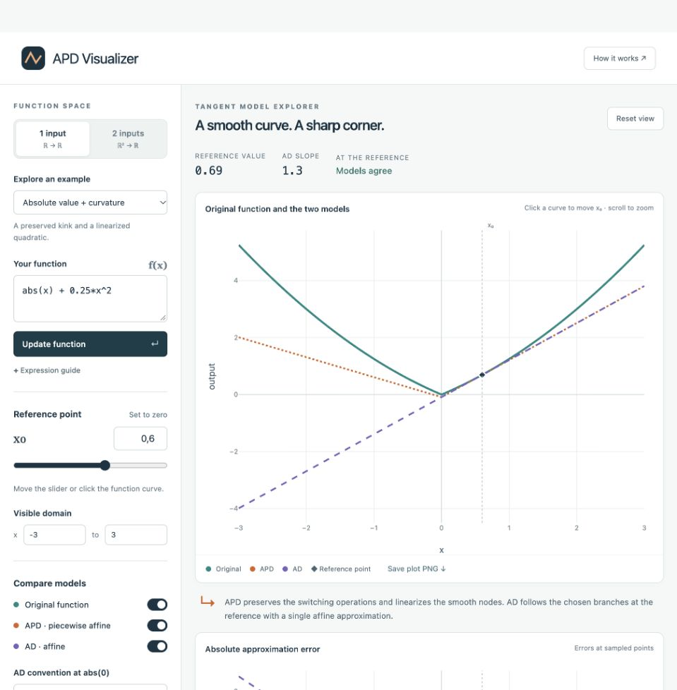
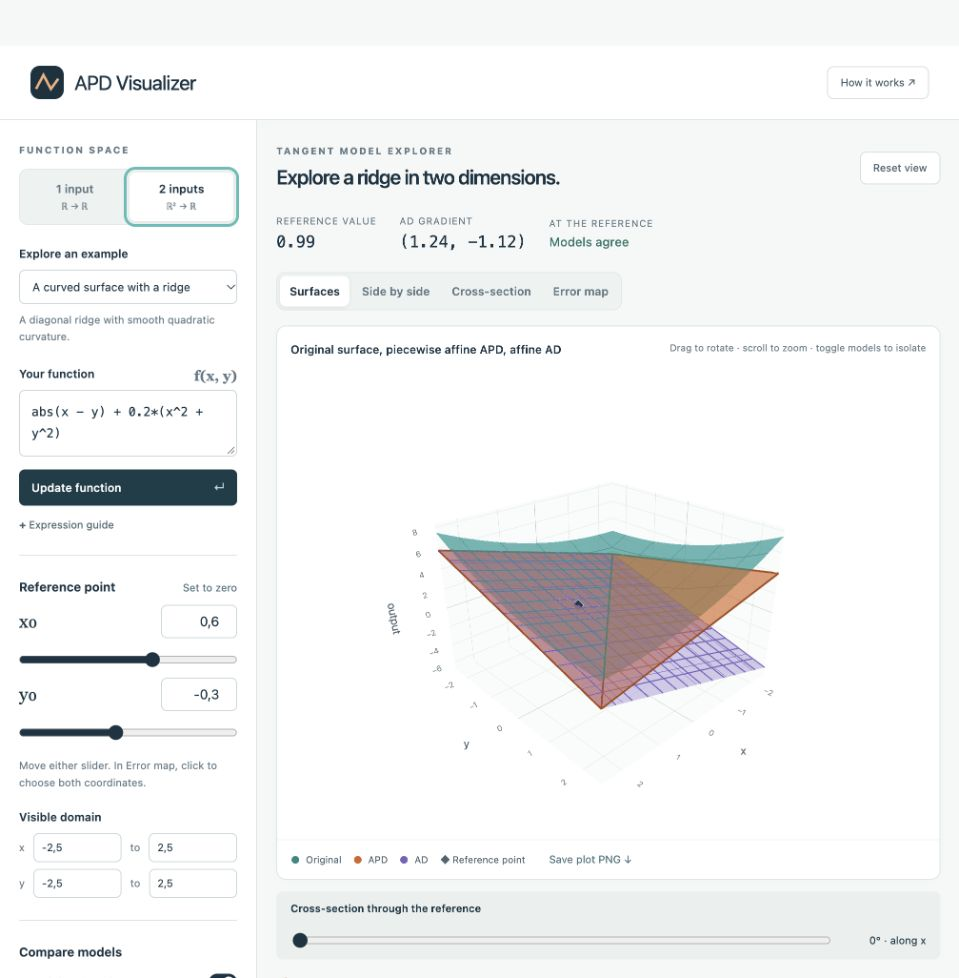

# APD Visualizer

[](https://github.com/RJD-Robert/apd-visualizer/actions/workflows/ci.yml)

**Explore how automatic piecewise differentiation preserves a function’s switching structure.**

An interactive browser tool for scalar functions of one or two inputs. Compare the original function, a tangent-mode **piecewise affine APD model**, and the **affine approximation from ordinary AD** at a movable reference point.

[Download the offline app](https://github.com/RJD-Robert/apd-visualizer/releases/latest) · [Mathematical guide](docs/METHOD.md) · [Validation](docs/TESTING.md)

| One input: curves and local models                        | Two inputs: surfaces and local models                         |
| --------------------------------------------------------- | ------------------------------------------------------------- |
|  |  |

## Start in seconds

**No installation:** download `APD-Visualizer.html` from the [latest release](https://github.com/RJD-Robert/apd-visualizer/releases/latest) and open it in your browser. The plotting library is bundled, so the app works offline.

**From the repository:** open [`dist/index.html`](dist/index.html), or use the optional Python launcher:

```sh
git clone https://github.com/RJD-Robert/apd-visualizer.git
cd apd-visualizer
python3 start.py
```

The launcher uses the Python standard library, selects an available localhost port, and opens your browser. On Windows, use `python start.py`. On macOS, you can also double-click `Open APD Visualizer.command`.

## Explore

| Feature             | What it shows                                                          |
| ------------------- | ---------------------------------------------------------------------- |
| One-input curves    | The original function and both models, with approximation errors below |
| Two-input surfaces  | Rotatable 3D overlays for `f(x, y)`                                    |
| Separate comparison | Original, APD, and AD on identical axes with synchronized cameras      |
| Cross-sections      | A line through the reference point at an adjustable angle              |
| Error maps          | Where either local model differs from the sampled original function    |
| Model inspection    | The AD formula and APD propagation rule at every node                  |

Each layer has its own switch. Move the reference with a slider or a numeric input; click a curve or an error map to choose it visually. Twelve examples cover smooth functions, nested absolute values, ReLU, min/max, and products. Export plots as PNG images.

### A useful first example

Choose `abs(x) + 0.25*x^2` and set the reference to `x₀ = 0`.

- **Original:** `f(x) = |x| + 0.25 x²`.
- **APD:** `P(x) = |x|`, retaining the corner.
- **AD:** `A(x) = 0` with the default convention `abs′(0) = 0`.

Move the reference to `x₀ = 0.6`. The APD model becomes `|x| + 0.3 x − 0.09`, while AD gives `1.3 x − 0.09`. The [mathematical guide](docs/METHOD.md) explains the construction and the selectable conventions at kinks.

## Expressions

Use `x` and, in two-input mode, `y`. Write multiplication explicitly (`2*x`) and powers as `x^2` or `x**2`.

```text
abs(x) + 0.25*x^2
abs(abs(x^2 - 0.5) - 0.2)
max(x^2, y^2)
abs(sin(x) + y^2 - 0.5)
```

Supported operations include `abs`, `relu`, `min`, `max`, trigonometric and hyperbolic functions, `exp`, `log`, `sqrt`, and powers. See the [full syntax and domain rules](docs/METHOD.md). Entered expressions are parsed as mathematics; they are never executed as Python or JavaScript code.

## Mathematical scope

This is **single-reference tangent-mode APD**. Smooth elemental operations are linearized at their original reference values; switching operations act on the propagated models. The resulting model depends on the computational expression.

APD curves are split at computed switching points. APD surfaces are triangulated within their affine regions, so triangles do not span a model crease. These calculations use ordinary floating-point arithmetic.

The original function and error maps use finite sampling. Narrow features and poles can be missed; inspect them with a smaller domain. At a kink, the AD slope follows an explicit convention and is not a unique derivative. Details and numerical limits are documented in [METHOD.md](docs/METHOD.md).

## Development and validation

The application has no package-install or build requirement. Node.js 22+ is used for the numerical tests; Python 3.10+ is used for the launcher and distribution checks.

```sh
node tests/validate-apd.cjs
python3 -m unittest discover -s tests -p 'test_*.py' -v
python3 build_offline.py --output APD-Visualizer.html
```

The numerical suite checks hand-derived APD formulas, independent finite differences, interpolation, narrow switching regions, and mesh coverage. [TESTING.md](docs/TESTING.md) separates automated checks from manual browser validation.

```text
dist/                  Editable browser application and bundled Plotly library
docs/                  Mathematical guide, validation notes, and screenshots
tests/                 Analytic numerical tests and distribution checks
start.py               Optional localhost launcher
build_offline.py       Single-file HTML packager
```

See [CONTRIBUTING.md](CONTRIBUTING.md) for the development workflow and useful bug reports.

## References

- Griewank et al., [_Piecewise linear secant approximation via algorithmic piecewise differentiation_](https://arxiv.org/html/1701.04368), §2 for the tangent construction.
- Griewank, [_On stable piecewise linearization and generalized algorithmic differentiation_](https://doi.org/10.1080/10556788.2013.796683), 2013.

## Rights and third-party software

Copyright © 2026 Robert Josef Domogalla. **No open-source license has been granted for the original project code.** Public availability does not grant general reuse or redistribution rights; see [COPYRIGHT.txt](COPYRIGHT.txt).

Plotly.js is distributed under its own MIT license. See [THIRD_PARTY_NOTICES.md](THIRD_PARTY_NOTICES.md) for attribution and the included license.
